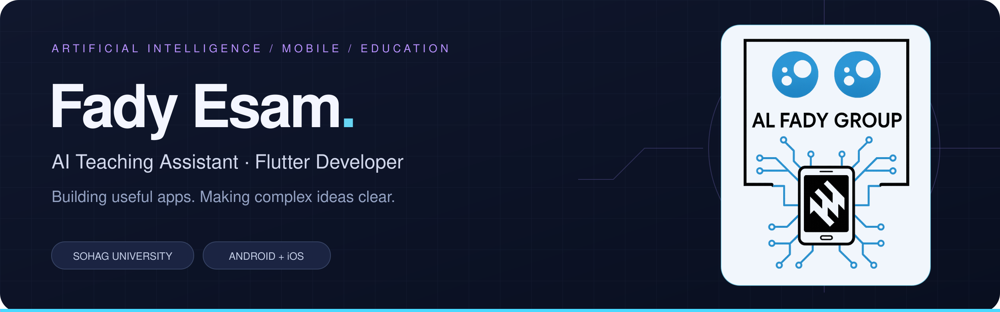

  

  
  
  
  

  <a href="#about-me">About</a> · <a href="#published-apps">Published Apps</a> · <a href="#technical-toolkit">Skills</a> · <a href="#teaching--research">Teaching &amp; Research</a> · <a href="#lets-connect">Contact</a>

## About me

I'm **Fady Esam**, an **AI Teaching Assistant at Sohag University**, in the Department of Artificial Intelligence & Data Science, and a **Flutter mobile developer**. I build applications people can use and help students turn technical concepts into working projects.

- **Academic foundation:** B.Sc. in Computers & Artificial Intelligence, 2024 — **Excellent with Honors**, ranked **first in the faculty and the AI & Data Science department**.
- **Product development:** Flutter applications published on **Google Play and the App Store**, from interface design and local data to audio experiences and release preparation.
- **Research interests:** machine learning, natural language processing, computer vision, and intelligent educational systems.

## Published apps

### Learn Coptic · تَعَلَّم القبطية

**A complete learning companion for the Coptic language — available on Android and iOS.**

Structured lessons bring together Coptic text, Arabic explanations, pronunciation audio, dictionaries, and prayers. Offline access and playback-speed controls let learners study at their own pace.

**Flutter · Dart · SQLite · Offline storage · Audio playback**

[**Google Play ↗**](https://play.google.com/store/apps/details?id=com.al_fady.coptic_learning_app) &nbsp; · &nbsp; [**App Store ↗**](https://apps.apple.com/us/app/ت-ع-ل-م-القبطية/id6791672008)

**10K+ downloads on Google Play** — public store milestone checked on September 11, 2026. [Source](https://play.google.com/store/apps/details?id=com.al_fady.coptic_learning_app).

<b>My engineering contributions</b>

- Designed and developed the Flutter application and its learning interface.
- Integrated pronunciation audio with Coptic and Arabic learning content.
- Implemented local storage and offline access to learning materials.
- Handled custom Coptic fonts and layouts across different screen sizes.
- Prepared and published Android and iOS releases.

---

### Afham Aketak · افهم عقيدتك

**Christian educational content in an accessible mobile experience.**

An application for exploring Christian faith and doctrine through organized educational content, with a clear interface and local data management.

**Flutter · Dart · Local storage · Android**

[**Google Play ↗**](https://play.google.com/store/apps/details?id=com.al_fady.afham_aketak_app)

<b>My engineering contributions</b>

- Designed the interface and developed the Flutter application.
- Structured educational content for straightforward navigation and reading.
- Implemented local data management and optimized application performance.
- Managed Android build preparation and Google Play publishing.

## Technical toolkit

  
  
  
  
  
  

| Area | Technologies & focus |
| :--- | :--- |
| **AI & data science** | Python, machine learning, deep learning, NLP, computer vision, data analysis |
| **Mobile development** | Flutter, Dart, Android & iOS, state management, REST APIs, offline experiences |
| **Databases & services** | SQL, SQLite, MySQL, Firebase, local data storage |
| **Engineering fundamentals** | OOP, algorithms, data structures, software architecture, performance optimization |
| **Workflow & communication** | Git, GitHub, Postman, Figma, LaTeX, technical presentations |

Additional languages and frameworks

C, C++, Kotlin, R, PHP, Django, and .NET.

## Teaching & research

At the **Faculty of Computers and Artificial Intelligence, Sohag University**, I support students in understanding concepts, writing code, and developing practical projects.

**Teaching areas:** artificial intelligence & machine learning, knowledge representation & reasoning, object-oriented programming, and Dart & Flutter mobile development.

**Research interests:** NLP, computer vision, speech and emotion recognition, human-centered AI, and AI-powered educational and mobile applications.

### FADY TECH

I share programming and technology content through **[FADY TECH](https://www.youtube.com/@FadyTech)**, bringing my experience as a teaching assistant and mobile developer to a wider audience.

**FROM CODE TO MODE**

## GitHub activity

[Explore my repositories →](https://github.com/Fadyesam?tab=repositories)

## Let's connect

Interested in **Flutter development, AI, or programming education**? Let's talk.

[**Email**](mailto:fadyesam100@gmail.com) · [**LinkedIn**](https://www.linkedin.com/in/fady-esam7/) · [**YouTube**](https://www.youtube.com/@FadyTech) · [**Facebook**](https://www.facebook.com/profile.php?id=100007067372175)

Additional contact

Phone: **+20 114 367 2671**

---

Building useful software. Sharing what I learn. Helping others build.

